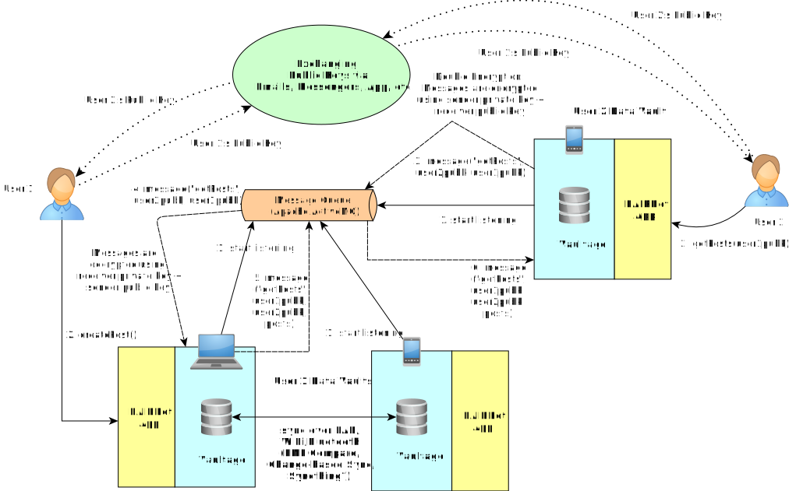
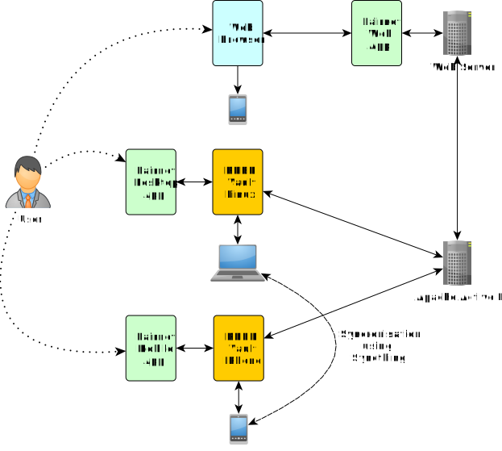
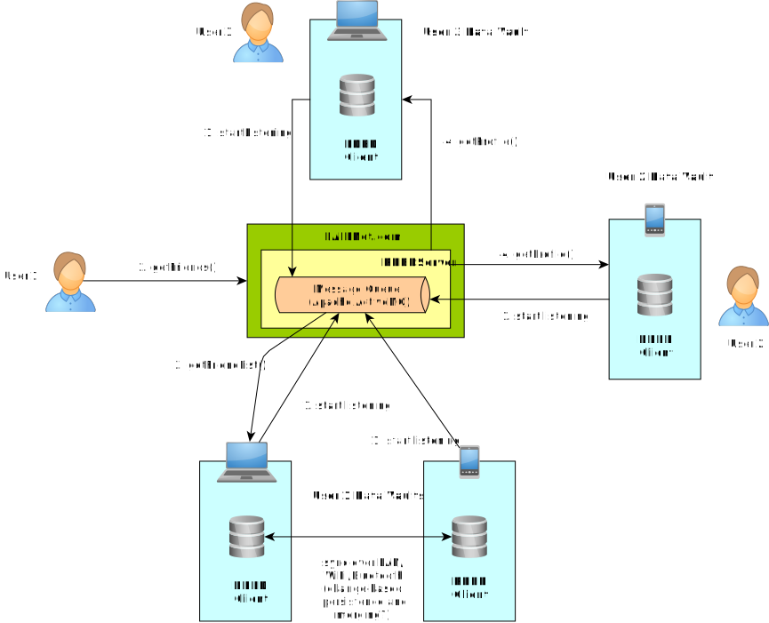
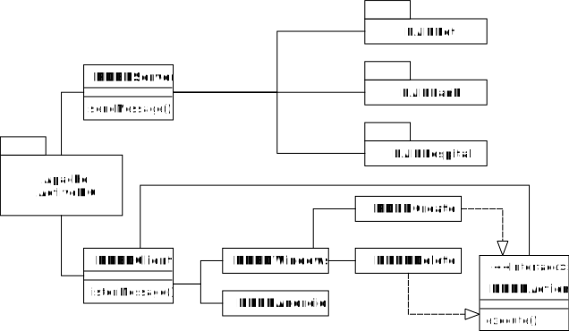
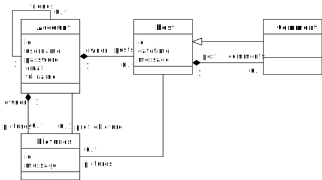
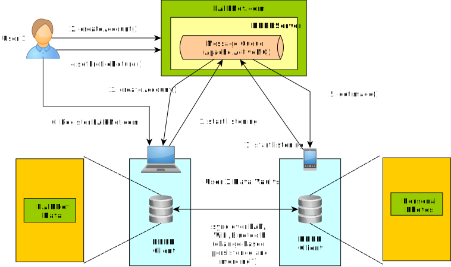
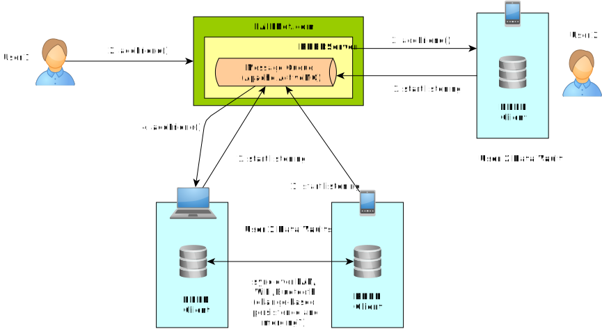

# Vaultage
**Vaultage** is a collaborative work between University of Maastricht and University of York that aims to move users' personal data from centralize servers to their personal data vaults/devices. It is designed to comply with the GDPR (https://gdpr.eu/) regulation on data protection and apply FAIR (Findable, Accessible, Interoperable, Re-usable) (https://www.go-fair.org/fair-principles/) data principles.

## How does **Vaultage** work?

### Security

- **Public Key Exchange**. Public keys between users are exchanged via emails, messengers, etc., or further extension of the app.
- **Double Encryption**. Messages are encrypted (decrypted) using both users' keys: sender private key + receiver public key (receiver private key + sender public key).
- **Encryption Algorithm**. RSA, key length 512 bits.

### Distributed Architecture

### Rdbd Schema

### Rdbd Class Diagram

### Rdbd Access Control

1. At the API level?
2. At the file / data level?
   1. Access control as implemented in UNIX filesystem?
   2. Access control as implemented in database systems?

## Example

**FAIRNet** is the FAIR version of Facebook that stores users' personal data in their personal data vaults/devices. It uses the Spark framework (http://sparkjava.com/). 

### Create Account

### Add Friend

### List Friends

## How to Run the Demo

To run the early prototype of this project:

1.  Download the source code from https://github.com/alfayohannis/rdbd.
2. Import the project to Eclipse. There are four projects:
   - **org.rdbd.core.client** (the implementation of Rdbd client)
   - **org.rdbd.core.client.windows** (the client for Windows OS)
   - **org.rdbd.core.server** (the implementation of Rdbd server)
   - **org.rdbd.demo.fairnet** (the implementation of the FAIRNet demo)
3. Download Apache ActiveMQ from https://activemq.apache.org/components/classic/download/. 
4. Unzip and run the server by executing ***bin/activemq start*** using command prompt or console.
5. Run ***RDBDWindows.java*** inside the **org.rdbd.core.client.windows** project. The client will listen incoming messages.
6. Run the **org.rdbd.demo.fairnet** project. 
7. Go to http://localhost:4567/account/create/ using your browser.
8. Fill in the *username* and *full name* textboxes. For now, the *username* field should be filled with **'foo'**.
9. Submit the form.
10. Go to the console of ***RDBDWindows.java*** that you previously ran on Eclipse. You will see that the client receive the message sent by the server.

